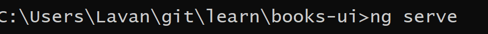

In this session we will create the UI that will talk to the API, that we created in an earlier session (session 2)

From the command line, use the ng cli to create our project with the following command

ng new books-ui


NG cli will request user prompts for the following:


Y - Angular Routing


Select CSS for style sheet


cli will install all relevant dependencies


Navigate to the folder that has been created by the cli


Launch VS Code - Code .


Invoke the CLI to serve the application



Launch the browser and navigate to http://localhost:4200, you will be presented with the application that the CLI has created.


Within VS Code, locate app.component.html
SRC => APP => app.component.html


Select all of the content within the file CTRL + A, and then delete.


You should be faced with an empty app.component.html


We are now going to add the Bootstrap CSS framework, to add styling as well as make our application responsive.

From your browser, navigate to
https://getbootstrap.com/docs/4.0/getting-started/introduction/#css


Navigate to Index to HTML and add the following entry to reference the bootstrap CSS.

```
<!doctype html>
<html lang="en">

<head>
  <meta charset="utf-8">
  <title>BooksUi</title>
  <base href="/">
  <meta name="viewport" content="width=device-width, initial-scale=1">
  <link rel="icon" type="image/x-icon" href="favicon.ico">
  <link rel="stylesheet" href="https://maxcdn.bootstrapcdn.com/bootstrap/4.0.0/css/bootstrap.min.css"
    integrity="sha384-Gn5384xqQ1aoWXA+058RXPxPg6fy4IWvTNh0E263XmFcJlSAwiGgFAW/dAiS6JXm" crossorigin="anonymous">
</head>

<body>
  <app-root></app-root>
</body>

</html>
```

Once you have saved the file after editing, the CLI will recompile the application. The browser will refresh - at this point it will be a blank.

We will now begin to add content to our application, using a mixture of Bootstrap styles and Angular Components.

Angular applications are built using a few simple building blocks : [Modules](https://angular.io/guide/architecture#modules) and [Components](https://angular.io/guide/architecture#components).

We will now create our first component, our "Home" Component", this will be the first page that is loaded when a user navigates to our application.

From the command line enter [NG G C](https://angular.io/cli#command-overview) home - this is short hand for NG Generate Component home (home being the name of our component).

```
ng g c home
```

Navigate to update the view, navigate to home.component.html
We are going to leverage the [Jumbotron](https://getbootstrap.com/docs/4.0/components/jumbotron/) Bootstrap Component to make a call out

```
<div class="row">
    <div class="col-12">
        <div class="jumbotron">
            <h1 class="display-4">Authors Management System</h1>
            <p class="lead">This is a simple hero unit, a simple jumbotron-style component for calling extra attention
                to
                featured content or information.</p>
            <hr class="my-4">
            <p>It uses utility classes for typography and spacing to space content out within the larger container.</p>
            <p class="lead">
                <a class="btn btn-primary btn-lg" href="#" role="button">Learn more</a>
            </p>
        </div>
    </div>
</div>

```

The Jumbotron is encapsulated with two bootstrap Styles, [row and col-12](https://getbootstrap.com/docs/4.0/layout/grid/#how-it-works), this component is further encapsulated in a [container](https://getbootstrap.com/docs/4.0/layout/overview/#containers) Bootstrap Style; this will be added to app.component.html shortly. This allows for our application to behave in a responsive manner.

To view our newly created component, we can leverage the [ css selector](https://angular.io/guide/architecture-components) value from home.component.ts as a html element

```
import { Component } from '@angular/core';

@Component({
  selector: 'app-root', (This is used as a html element in our html)
  templateUrl: './app.component.html',
  styleUrls: ['./app.component.css']
})
export class AppComponent {
  title = 'books-ui';


}
```

In app.component.html - enter

```
<app-home></app-home>
```

Once recompiled, you will be presented with our jumbotron


We've now created our component and used it like a html element i.e
` <div> </div>` with Angular taking care of creating an inserting an instance of home.component whenever it finds ` <app-home> </app-home>`.

However, as noted from the documentation, an Angular application is a series of components that control a specific view contained in one or more modules.

For this application, we will create the following components

- navbar - this component will contain our navigation links and leverage the [Angular Router](https://angular.io/guide/router) for in app navigation.
- authors - this component will display the list of Authors in a tabular format
- author-details - this component will display the details of a specific author and allow updating

We will also leverage an [Angular Service](https://angular.io/tutorial/toh-pt4) to call our API that we created in Session 2.

To create the list of components enter the following commands, from the command prompt, one by one, followed by the Enter Key.

```
ng g c navbar
ng g c authors
ng g c author-details
ng g c page-not-found

```

Now, create a [service](https://angular.io/tutorial/toh-pt4) to call our API

```
ng g s authors
```

Navigate to and open app-routing.module.ts - this is our routing module to control in [app navigation](https://angular.io/tutorial/toh-pt5)

The router module will contain a variable for routes, with an empty array. We will now furnish our routes for application, with the relevant components we just created, as well as add the relevant angular dependencies.

```
import { NgModule } from '@angular/core';
import { Routes, RouterModule } from '@angular/router';
import { AuthorsComponent } from './authors/authors.component';
import { PageNotFoundComponent } from './page-not-found/page-not-found.component';
import { HomeComponent } from './home/home.component';
import { AuthorDetailsComponent } from './author-details/author-details.component';

const routes: Routes = [
  { path: 'authors', component: AuthorsComponent },
  { path: 'author/:genre/:id', component: AuthorDetailsComponent },
  { path: 'home', component: HomeComponent },
  { path: '', redirectTo: '/home', pathMatch: 'full' }, // redirect to `first-component`
  { path: '**', component: PageNotFoundComponent },  // Wildcard route for a 404 page
];

@NgModule({
  imports: [RouterModule.forRoot(routes)],
  exports: [RouterModule]
})
export class AppRoutingModule { }


```

The route `author/:genre/:id`, takes two [parameters](https://angular.io/guide/router#accessing-query-parameters-and-fragments) in the route `genre` and `id`, this values are used by our authors service to call the api with those values to retrieve information on a particular author.

To create the NavBar, we will leverage the bootstrap [navbar](https://getbootstrap.com/docs/4.0/components/navbar/#nav) component provided by Bootrap

In navbar.component.html

```

<nav class="navbar navbar-expand-lg navbar-light bg-light">
    <a class="navbar-brand" href="#">Navbar</a>
    <button class="navbar-toggler" type="button" data-toggle="collapse" data-target="#navbarNav"
        aria-controls="navbarNav" aria-expanded="false" aria-label="Toggle navigation"
        (click)="isCollapsed = !isCollapsed">
        <span class="navbar-toggler-icon"></span>
    </button>
    <div class="collapse navbar-collapse" [ngClass]="{show:isCollapsed}" id="navbarNav">
        <ul class="navbar-nav">
            <li class="nav-item active">
                <a class="nav-link" href="#">Home <span class="sr-only">(current)</span></a>
            </li>
            <li class="nav-item">
                <a class="nav-link" routerLink='/authors'>Authors</a>
            </li>
            <li class="nav-item">
                <a class="nav-link" href="#">Pricing</a>
            </li>
            <li class="nav-item">
                <a class="nav-link disabled" href="#">Disabled</a>
            </li>
        </ul>
    </div>
</nav>

```

We will use the [routerLink](https://angular.io/api/router/RouterLink) feature of angular to initiate a navigation to the desired route, when the user clicks a navigation item from the menu.

When the application is running on a small display, it will display a responsive menu with a hamburger icon.

As Angular is a JS Framework, the framework will manage the lifecycle and events on user interactions.

What we need to do, is to be able to toggle the navbar when we click the hamburger icon, and add the css element 'show'. This will then show the navbar elements for navigation.

To do this, we leverage the `NgClass` directive

- https://angular.io/api/common/NgClass
- https://blog.angular-university.io/angular-ngclass-ngstyle/

```
<div class="collapse navbar-collapse" [ngClass]="{show:isCollapsed}" id="navbarNav">

```

In navbar.component.ts, we declare a variable that will allow us to toggle the navbar. The variable will be of type Boolean and called isCollapsed

```
isCollapsed = false;
```

When the hamburger button is clicked, we want to set the isClicked to True. Once set to true, the ngClass directive will add the show css style to display the navbar

```
<button class="navbar-toggler" type="button" data-toggle="collapse" data-target="#navbarNav"
        aria-controls="navbarNav" aria-expanded="false" aria-label="Toggle navigation"
        (click)="isCollapsed = !isCollapsed">
        <span class="navbar-toggler-icon"></span>
 </button>

```

Next we will create a model that contains the data that represents an Author

```

export interface Author {
    id: string;
    picture: string;
    age: number;
    genre: string;
    name: string;
    gender: string;
    email: string;
    phone: string;
    authorBio: string;
    publishDate: string;
    tags: string[];
}

```

Next we will update the Authors component to display the authors in a tabular format.

We use two directives [ngIf and ngFor](https://angular.io/guide/structural-directives), to help display user content.

When our authors service calls the API, it will store the results of the Authors in a strongly types list of Authors.

We can then access the relevant properties exposed by the author model. In this example, we access each property of the Author model when creating the table.

The ngIf is used to hide the table if the list is not populated.

[Interpolation](https://angular.io/guide/interpolation#interpolation-), Angular will evaluate the the contents within the `{{ author.name }}`, in this case author.name and display the string value of it's contents.

```
<div class="row">
    <div class="col-12">
        <div>
            <label>Category:</label>
            <select (change)="getAuthorsByCategory($event.target.value)">
                <option disabled>Selecta category</option>
                <option>Choose Category</option>
                <option *ngFor="let category of categories">{{category}}</option>
            </select>
        </div>
    </div>
</div>

<div class="row">
    <div class="col-12">


        <table class="table" *ngIf="authors">
            <thead>
                <tr>
                    <th scope="col">Name</th>
                    <th scope="col">Email</th>
                    <th scope="col">Genre</th>
                    <th scope="col">Last Published</th>
                </tr>
            </thead>
            <tbody>
                <tr *ngFor="let author of authors" (click)="goToAuthorDetails(author.genre, author.id)">
                    <td>
                        {{author.name}}
                    </td>

                    <td>
                        {{author.email}}
                    </td>

                    <td>
                        {{author.genre}}
                    </td>

                    <td>
                        {{author.publishDate}}
                    </td>
                </tr>
            </tbody>
        </table>
    </div>
</div>

```

Within the Authors Component, we leverage our Authors Service. This is injected from the constructor through [Dependency Injection](https://angular.io/guide/dependency-injection).

Within the component, we've created an Array to hold the categories, this is used to get as an argument to call the API.

We create an Authors object to hold an Author object

As well as create the relevant methods to retrieve Authors through the service, as well as create a method to navigate to the author details page with the relevant parameters.

```
import { Component, OnInit } from '@angular/core';
import { Author } from '../models/author';
import { AuthorsService } from '../authors.service';
import { Router } from '@angular/router';

@Component({
  selector: 'app-authors',
  templateUrl: './authors.component.html',
  styleUrls: ['./authors.component.css']
})
export class AuthorsComponent implements OnInit {
  categories: any = ['Classics', 'Fantasy', 'Detective']
  authors: Author[];
  constructor(private authorService: AuthorsService, private router: Router) { }
  ngOnInit(): void {
  }

  getAuthorsByCategory(category: string) {
    this.authorService.returnAuthorsByCategory(category).subscribe(resp => {
      console.log(resp);
      this.authors = resp;
    }, err => {
      console.log(err);
    })

  }

  goToAuthorDetails(genre: string, id: string) {
    this.router.navigate(['/author', genre, id]);
  }

}
```

Next navigate to the authors.service.ts, and implement the relevant methods to access the API

We leverage the [Angular HTTP Client](https://angular.io/guide/http) to talk to backend services.

We also leverage [Angular Observable](https://angular.io/guide/observables-in-angular) to handle Asynchronous operations.

```
import { Injectable } from '@angular/core';
import { HttpClient } from '@angular/common/http';
import { Author } from './models/author';
@Injectable({
  providedIn: 'root'
})
export class AuthorsService {

  constructor(private httpClient: HttpClient) { }


  returnAuthorsByCategory(category: string) {
    return this.httpClient.get<Author[]>(`https://localhost:44349/api/Authors/${category}`);
  }

  returnAuthorByGenreAndId(genre: string, id: string) {
    // https://localhost:44349/api/Authors/Classics/ff1eba9d-f9c2-4ff9-85c9-d59a47908b96
    return this.httpClient.get<Author>(` https://localhost:44349/api/Authors/${genre}/${id}`);
  }


  updateAuthor(author: Author) {
    return this.httpClient.put<Author>('https://localhost:44349/api/Authors', author);
  }

}


```

We will now add the relevant details for the author details component. In this component, we leverage the route params to get the author by it's id. We use genre, as we use genre to partition our cosmosdb instance.

In author-details.component.ts

We create two variables to hold the values from the router

we leverage [ActivatedRoute](https://angular.io/guide/router#getting-route-information) to get Route information, as well as our Author Service to call our backend.

Angular provides a series of lifecycle hooks for us to leverage. In this instance, we are using the [ngOnIt](https://angular.io/api/core/OnInit) hook. This hook is called after Angular initialised the component.

We subscribe to the route params from the ActivatedRouteObject. Once the asynchronous operation completes, we are able to get the ID and Genre from the URL, these values are then used by our service to call the backend and retrieve author details.

We also have an update author method that allows us to make changes to our Author, and persist those changes back into Cosmos DB.

```
import { Component, OnInit } from '@angular/core';
import { ActivatedRoute } from '@angular/router';
import { AuthorsService } from '../authors.service';
import { Author } from '../models/author';

@Component({
  selector: 'app-author-details',
  templateUrl: './author-details.component.html',
  styleUrls: ['./author-details.component.css'],
})
export class AuthorDetailsComponent implements OnInit {
  genre: string;
  id: string;
  author: Author;
  constructor(
    private route: ActivatedRoute,
    private authorService: AuthorsService
  ) {}

  ngOnInit(): void {
    this.route.params.subscribe((params) => {
      this.id = params['id'];
      this.genre = params['genre'];

      this.authorService
        .returnAuthorByGenreAndId(this.genre, this.id)
        .subscribe(
          (resp) => {
            console.log(resp);
            this.author = resp;
          },
          (error) => {
            console.log(error);
          }
        );
    });
  }

  updateAuthor() {
    this.authorService.updateAuthor(this.author).subscribe(
      (response) => {
        console.log(response);
        this.author = response;
      },
      (error) => {
        console.log(error);
      }
    );
  }
}
```

Finally, we will apply the relevant html elements to render our display

<div class="row">
    <div class="col-12">

        <form *ngIf="author" (ngSubmit)="updateAuthor()">
            <div class="form-group row">
                <label for="name" class="col-sm-2 col-form-label">Id</label>
                <div class="col-sm-10">
                    <input type="text" class="form-control" id="id" name="id" placeholder="id" value="{{author.id}}"
                        readonly>
                </div>
            </div>
            <div class="form-group row">
                <label for="name" class="col-sm-2 col-form-label">Name</label>
                <div class="col-sm-10">
                    <input type="text" class="form-control" id="name" name="name" placeholder="Name"
                        value="{{author.name}}" [(ngModel)]='author.name'>
                </div>
            </div>

            <div class="form-group row">
                <label for="name" class="col-sm-2 col-form-label">Email</label>
                <div class="col-sm-10">
                    <input type="text" class="form-control" id="email" name="email" placeholder="email"
                        value="{{author.email}}" [(ngModel)]='author.email'>
                </div>
            </div>

            <div class="form-group row">
                <label for="genre" class="col-sm-2 col-form-label">Genre</label>
                <div class="col-sm-10">
                    <input type="text" class="form-control" id="Genre" name="genre" placeholder="genre"
                        value="{{author.genre}}" [(ngModel)]='author.genre'>
                </div>
            </div>

            <div class="form-group row">
                <label for="phone" class="col-sm-2 col-form-label">Phone</label>
                <div class="col-sm-10">
                    <input type="text" class="form-control" id="phone" name="phone" placeholder="phone"
                        value="{{author.phone}}" [(ngModel)]='author.phone'>
                </div>
            </div>


            <div class="form-group row">
                <div class="col-sm-10">
                    <button class="button" type="submit">Update</button>
                </div>
            </div>
        </form>
    </div>


    <div class="col-12">

        <pre>
            {{author |json}}
            </pre>
    </div>

</div>

[Two Way data binding](https://blog.thoughtram.io/angular/2016/10/13/two-way-data-binding-in-angular-2.html) is used reflect changes in the application state to the view.

We use the [ngSubmit](https://angular.io/api/forms/NgForm) event to handle the update and call our method `updateAuthor()`. We also use the `<pre> </pre>` to display our preformatted text. The [JsonPipe](https://angular.io/api/common/JsonPipe) is used to convert the value into a JSON representation
